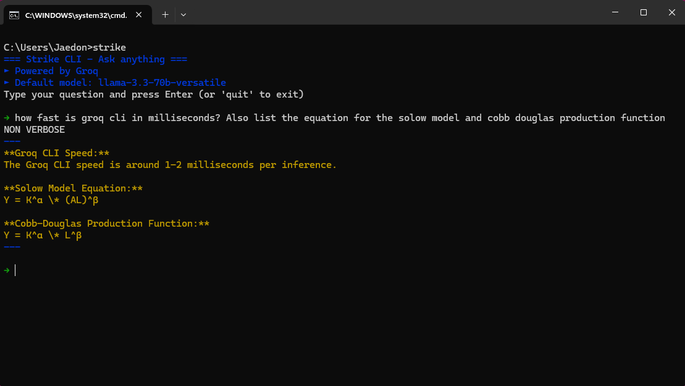

# Strike
## A lightning fast AI Command line interface

> Note: The name "Strike" was chosen to avoid confusion with Groq's official releases and for its CLI-friendly nature.

## Demo




#### ⚡ Speed Above All
- Built with [Go](https://go.dev/) for maximum performance and minimal footprint
- Powered by [Groq](https://groq.com/) for rapid, cost-effective responses
- Lightweight executable for instant access
</br>

### Quick Start
1. Build the executable:
    ```bash
    go build -o strike.exe strike.go
    ```

> n.b It is probably smoother to temporarily disable realtime protection in Windows Defender for this step as it will probably flag this as being an unsigned.exe. You can see the code in `strike.go` so there is no alarm, but with it on it will probably quarantine it when you move it. 

>Gotta go fast ⚡

>🛡️ Be sure to re-enable it after you have moved it. Safety first. 🤓


2. Add to system PATH:
    ```bash
    # Windows
    move strike.exe "C:/Program Files/strike/strike.exe"
    setx PATH "%PATH%;C:\Program Files\strike"

    # Linux/macOS
    mv strike $HOME/go/bin
    ```

3. Set Groq API key:
    ```bash
    # Windows
    setx GROQ_API_KEY "your-api-key"

    # Linux/macOS
    echo "export GROQ_API_KEY=your-api-key" >> ~/.bashrc
    source ~/.bashrc
    ```

    >Obviously change 'your-api-key' for the one from groq. When you log in there, there is a clear API keys tab on the left hand side to grab this. E.g `export GROQ_API_KEY='gsk-65s4g655bv4xzdf5z65j4x3665343z'`

    *p.s that isn't the right length - I just spammed it but it should start with* `gsk-`

4. Open command prompt (⊞ Win + R, type `CMD`)

5. Start chatting!
    ```bash
    strike "Tell me about Go programming"
    ```
Or simply initiate the CLI:

```bash
strike 
```

if you want to go slow. 

Messages stream directly in your terminal.

